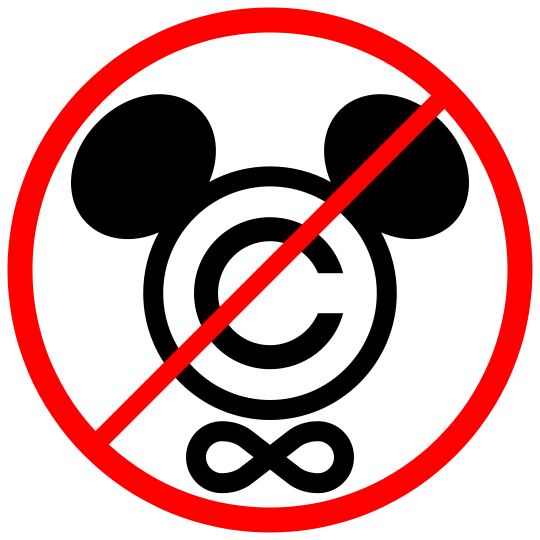
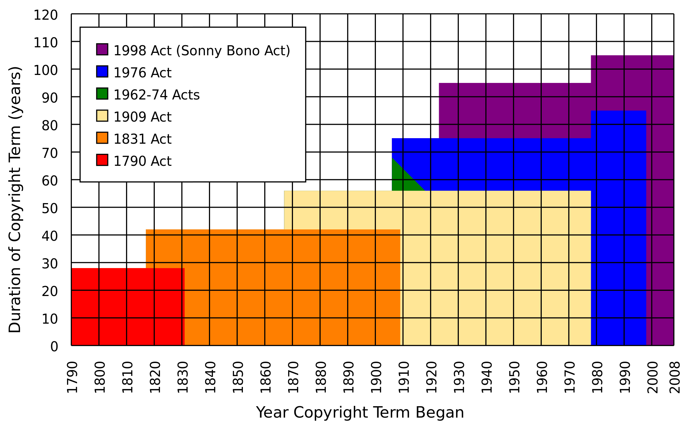
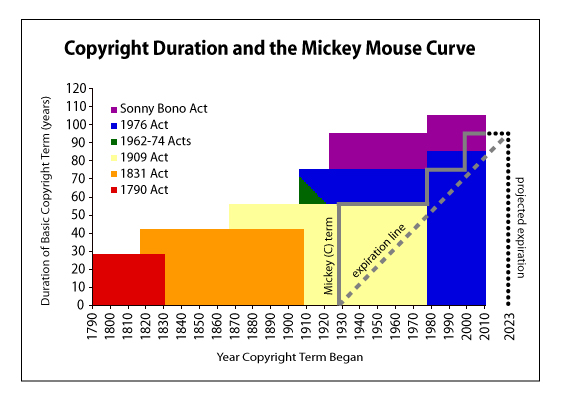

<!DOCTYPE html>
<html>
  <head>
    <title>Title</title>
    <meta http-equiv="Content-Type" content="text/html; charset=UTF-8"/>
    
  </head>
  <body>
    <textarea id="source">

class: center, middle

# Santé, gauche d'auteur & logiciel libre

Jérôme Pinguet

jerome@jerome.cc

http://librehealthcare.org

https://medecinelibre.com

Cette œuvre est mise à disposition sous licence Attribution - Partage dans les
Mêmes Conditions 3.0 France. Pour voir une copie de cette licence, visitez
http://creativecommons.org/licenses/by-sa/3.0/fr/ ou écrivez à Creative
Commons, 444 Castro Street, Suite 900, Mountain View, California, 94041,
USA.
---

# Plan

1. gauche d'auteur
2. droit d'auteur
3. accès libre à la connaissance scientifique
4. ressources éducatives libres
5. logiciel libre en santé

---

# Gauche d'auteur 1

Le copyleft utilise le copyright (ou le droit d'auteur), en le retournant pour lui faire
servir le but opposé de ce pour quoi il a été conçu : ce n'est pas une manière de
restreindre l'utilisation d'un logiciel, mais une manière de le laisser « libre ». [...]

En 1984 ou 1985, Don Hopkins (dont l'imagination était sans bornes) m'a envoyé une
lettre. Il avait écrit sur l'enveloppe plusieurs phrases amusantes, et notamment
celle-ci :

Copyleft - all rights reversed.

J'ai utilisé le mot « copyleft » pour donner
un nom au concept de distribution que je développais alors.

Richard Stallman

Référence:

Stallman R. The GNU operating system and the free software movement., dans Dibona C,
Ockman S. Open Sources: Voices from the Open Source Revolution. [Lieu inconnu]: O'Reilly
Media ; 1999, p. 53-70.

---

# Gauche d'auteur 2

Le scriptorium fut le lieu principal de transmission du savoir médical du VIème au
XIII ème siècle. Les copies successives entraînent des modifications, auxquelles s'ajoutent
gloses et commentaires : « Ainsi le texte médical reste vivant, il n'est pas fixé, il est ouvert à
l'innovation, il se transforme, il se rajeunit. Restant actif, il suscite d'autres textes. »

Référence:

Debru A, Sabbah G. Nommer la maladie. Recherches sur le lexique gréco-latin de la
pathologie. Saint Etienne: PU Saint-Etienne ; 1998. Observations sur la transmission des textes
médicaux latins.

---

# Gauche d'auteur 3

La transmission libre des œuvres de l'esprit avec citation de l'auteur est un fait observé depuis
les débuts de l'humanité jusqu'au développement de l'imprimerie au quinzième siècle.

La transmission libre des connaissances est ce qui fonde la science (notamment médicale).

---

# Droit d'auteur 1

---

# Droit d'auteur 2

---

# Droit d'auteur 3

Le droit d'auteur ne protège plus les intérêts de l'auteur mais ceux
de ses ayants droits.

---

# Droit d'auteur, copyright troll, patent troll & enseignement de la médecine

Le cas du MMSE (Mini Mental State Evaluation).

Sweet 16 (équivalent libre) attaqué en justice.

«en un sens, la gauche d'auteur est la manière dont la médecine académique
a toujours fonctionné»

Source: Newman, John C, et Robin Feldman. « Copyright and open access at the bedside. » The New England Journal Of Medicine 365, no. 26 (décembre 29, 2011): 2447-2449.

---

# Accès libre à la connaissance scientifique

## Open access

* Aaron Swartz & jstor
* green open access
* self-archiving preprint, postprint, eprint [arXiv.org](http://arxive.org)
* gold open access
  * PloS ONE
  * PubMed Central
* future: self publishing (articles & données) [academictorrents.com](http://academictorrents.com) ?

---

## Open access: PloS

1. Accès libre
2. Excellence
3. Intégrité scientifique
4. Extension à d'autres domaines scientifiques que les sciences de la vie
5. Coopération
6. Équité financière: en tant qu'organisation à but non lucratif PloS demande aux auteurs une
participation reflétant le coût réel de publication
7. Engagement dans la communauté
8. Internationalisme
9. La science en tant que bien public

---

# Ressources éducatives libres

* A l'initiative du MIT
* California Open Source Textbook Project
* Université médicale virtuelle francophone:
  * copyright
  * pas de mention de licence donc copyright
  * rares éléments sous copyleft
* Pourquoi ne pas demandez à vos enseignants de libérer leurs cours en les publiant sous licence libre? :)

---

# Logiciel libre

"Quand les utilisateurs ne contrôlent pas le programme, c'est le
programme qui les contrôle"

Richard Stallman

---

* La liberté d'exécuter le programme, pour tous les usages (liberté 0).
* La liberté d'étudier le fonctionnement du programme, et de le modifier pour qu'il
effectue vos tâches informatiques comme vous le souhaitez (liberté 1). L'accès au
code source est une condition nécessaire.
* La liberté de redistribuer des copies, donc d'aider votre voisin (liberté 2).
* La liberté de distribuer aux autres des copies de vos versions modifiées (liberté 3).

En faisant cela, vous donnez à toute la communauté une possibilité de profiter de vos
changements ; l'accès au code source est une condition nécessaire.

---

# Liberté 0

La liberté d'exécuter le programme, pour tous les usages.

Accès pour tous à des systèmes d'information médicale de qualité.

Exemple de [mediboard.org](http://mediboard.org) au Mali.

Référence: Bagayoko, Cheick-Oumar, Jean-Charles Dufour, Saad Chaacho, Omar Bouhaddou, et Marius
Fieschi. «Open source challenges for hospital information system (HIS) in developing countries: a
pilot project in Mali». BMC medical informatics and decision making 10 (2010): 22.

---

# Liberté 1

La liberté d'étudier le fonctionnement du programme, et de le modifier pour qu'il
effectue vos tâches informatiques comme vous le souhaitez (liberté 1). L'accès au
code source est une condition nécessaire.

* sécurité des données personnelles
* co-développement des applications (pays à ressources limitées) & donc co-développement économique

---

# Logiciel libre & problématiques liées à la santé

* Indépendance
* publicité
* transparence
* conflit d'intérêt
* industrie pharmaceutique

---

# Logiciel libre en santé, des avantages pratiques 1

* adaptation
 * au contexte sociale
 * au contexte économique
 * aux réalités locales
 * culture, langue
* personnalisation
* paramétrage
* pérennité
* interopérabilité
* standards ouverts

---

# Logiciel libre en santé, des avantages pratiques 2

* Sécurité
* fiabilité
* performance
* confidentialité

---

# Logiciel libre: GNU Health / Gnu Solidario

GNU Solidario works globally, delivering health and education to the underprivileged by means of Free Software.

* [health.gnu.org](http://health.gnu.org]
 * Electronic Medical Record (EMR)
 * Hospital Information System (HIS)
 * Health Information System
 * Luis Falcón
 * 2008 
 * soutenu par le projet GNU et la Free Software Foundation
 
---

# Open hardware

* seringues électriques imprimées en 3D: 10, 100 fois moins chères à produires?
* La vidéo du début parlait de logiciel à l'intérieur de nous-même: défibrillateur implantable et logiciel (firmware)
 * sécurité
 * fiabilité

--- 

# Projets

* construire 1 base de connaissance libre et open source sur les médicaments
 * rapport bénéfice / risque
 * interactions médicamenteuses libres (Free DDI Manager) : https://freemedforms.com/fr/news/freeddimanager/announcement

 * FreeMedForms.com et FreeDIAMS

---

# The End

Merci! :)

    </textarea>
    
    
  </body>
</html>
